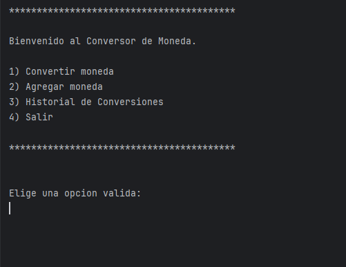
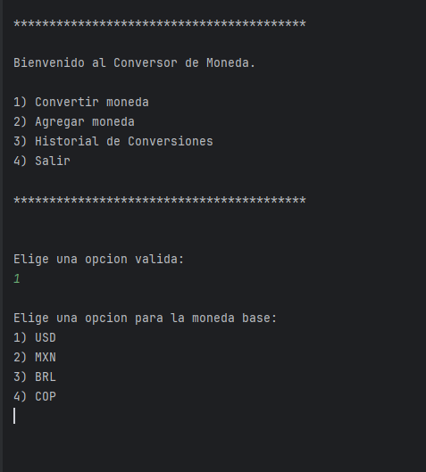
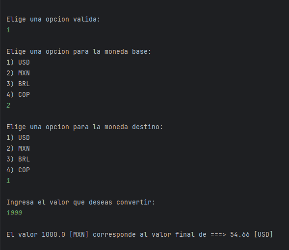
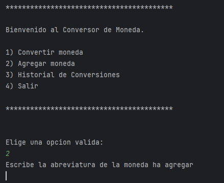
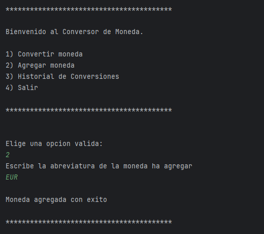
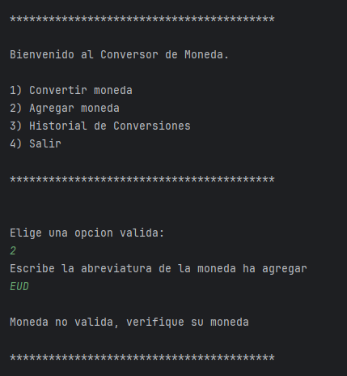
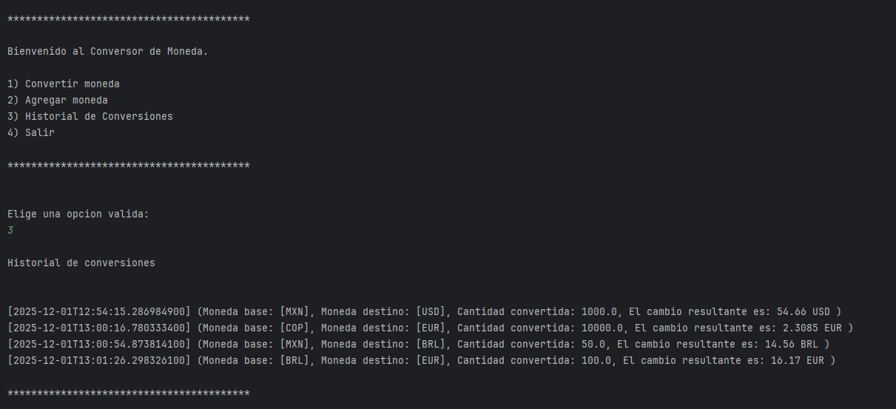
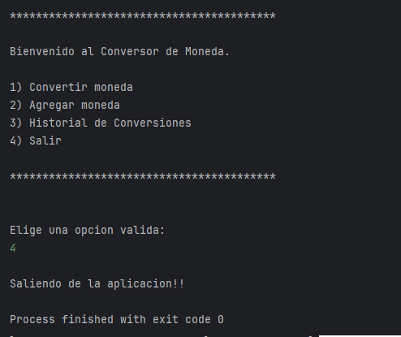

# Conversor de Monedas

Este es un proyecto interactivo en el que podrás realizar:
1) Consulta de cambio de una moneda a otra.
2) Agregar mas tipos de moneda
3) Visualizar el historial de cambio

## Instalación

Para instalar el proyecto se necesita clonar el repositorio

```bash
  git clone https://github.com/OscarCuso/conversor-de-monedas
  cd conversor-de-monedas
```

## Uso del proyecto

Para iniciar el proyecto es necesario abrirlo desde un IDE, una vez abierto el proyecto lo podemos iniciar

Una vez iniciando el proyecto aparecerá este menu


En la primera opcion podremos hacer el cambio de monedas


En el cual debemos seleccionar la moneda base y la moneda a la cual queremos cambiar, posteriormente debemos poner el monto a convertir para obtener el resultado de la conversion


En la opcion 2 podemos agregar una nueva moneda a la lista


Para agregar la moneda debemos poner la abreviatura de la moneda y si es correcta se agregara a la lista


En caso contrario, si la moneda no existe no se agregara a la lista y mostrara un mensaje de error


En la opcion 3 podremos visualizar el historial de las conversiones con la fecha de aplicacion


Y por último en la opcion 4, nos saca de la aplicacion



## Autores

- [@OscarCuso](https://github.com/OscarCuso)